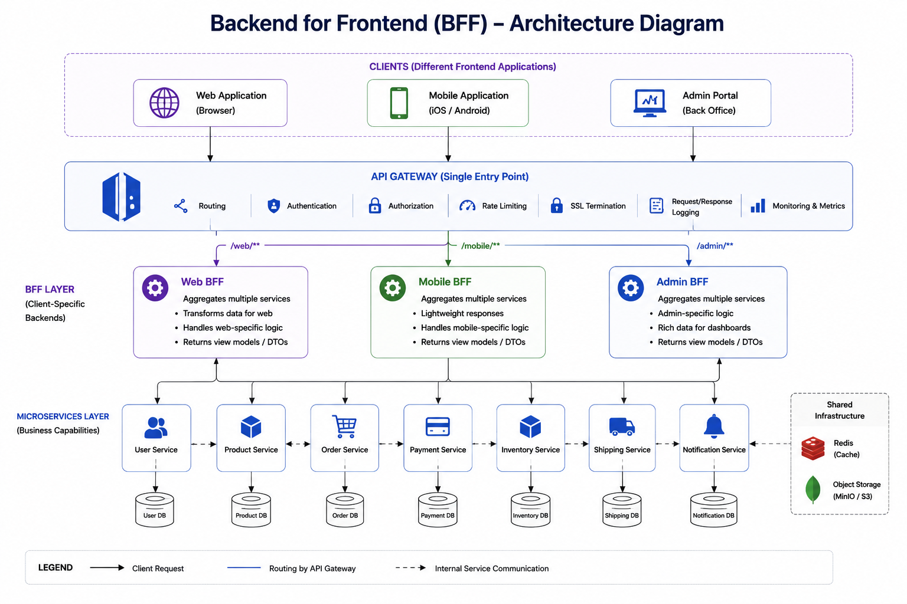

# Backend for Frontend (BFF) Pattern

> An architectural pattern where each client application has its own dedicated backend that is optimized for its specific needs.

---

# Table of Contents

- Overview
- Problem
- Solution
- Why Do We Need It?
- How It Works
- Architecture
- Request Flow
- BFF vs API Gateway
- BFF vs API Composition
- Advantages
- Disadvantages
- When to Use
- When NOT to Use
- Common Mistakes
- Best Practices
- Spring Boot Example
- Interview Questions
- References

---

# Overview

Modern applications often have multiple clients:

- Web Application
- Mobile Application
- Admin Portal
- Smart TV
- Desktop Application

Although these clients consume the same business capabilities, they usually require different data formats, authentication mechanisms, and response structures.

The **Backend for Frontend (BFF)** pattern creates a dedicated backend for each client, allowing each frontend to receive exactly the data it needs.

---

# Problem

Suppose three clients directly call the same API Gateway.

```
          Web
            │
Mobile ─────┼─────► API Gateway
            │
         Admin
```

The gateway forwards all requests to the same backend services.

Problems:

- Over-fetching
- Under-fetching
- Many API calls
- Complex frontend logic
- Different authentication requirements
- Different response formats

Example:

The mobile app only needs:

- Product Name
- Price

The web application also needs:

- Description
- Reviews
- Recommendations
- Seller Information

Using the same API increases unnecessary network traffic.

---

# Solution

Introduce a dedicated backend for each frontend.

```
Client
   |
API Gateway
   |
Web BFF
   |
Microservices
```

Each BFF is optimized for one client.

---

# Why Do We Need It?

BFF provides:

- Client-specific APIs
- Better performance
- Smaller payloads
- Simpler frontend code
- Independent frontend evolution
- Better security
- Easier versioning

---

# How It Works

1. Client sends request.
2. Request reaches its dedicated BFF.
3. BFF calls one or more microservices.
4. BFF transforms the response.
5. Client receives optimized data.

---

# Architecture


---

# Request Flow

Example:

```
Mobile App

↓

Mobile BFF

↓

Order Service

↓

Product Service

↓

Payment Service

↓

Aggregate Response

↓

Mobile App
```

The mobile application receives only the required fields.

---

# Example

### Mobile Response

```json
{
  "orderId": 100,
  "status": "PAID",
  "total": 150
}
```

---

### Web Response

```json
{
  "orderId": 100,
  "status": "PAID",
  "total": 150,
  "customer": {
    "name": "John"
  },
  "items": [
    ...
  ],
  "shippingAddress": "...",
  "paymentHistory": [...]
}
```

Each client receives a tailored response.

---

# BFF vs API Gateway

| API Gateway | Backend for Frontend |
|-------------|----------------------|
| Entry point for all clients | Dedicated backend for one client |
| Routing | Business composition |
| Authentication | Client-specific logic |
| Rate limiting | Response transformation |
| Load balancing | Aggregation |
| Service discovery | Client optimization |

The API Gateway handles infrastructure concerns.

The BFF handles client-specific business needs.

---

# BFF vs API Composition

| Backend for Frontend | API Composition |
|----------------------|----------------|
| Client-focused | Data-focused |
| One backend per client | Aggregates multiple services |
| May use API Composition internally | Pattern used inside BFF or Gateway |

A BFF often implements **API Composition** to build a response.

---

# Advantages

- Optimized responses
- Less network traffic
- Better frontend performance
- Independent frontend evolution
- Cleaner frontend code
- Better scalability
- Easier API versioning

---

# Disadvantages

- More services to maintain
- Additional deployment
- Code duplication
- Higher operational complexity

---

# When to Use

✅ Multiple frontend applications

✅ Mobile + Web

✅ Admin dashboards

✅ Public APIs

✅ Different authentication requirements

✅ Different response models

---

# When NOT to Use

❌ Single frontend application

❌ Small CRUD systems

❌ Simple internal tools

---
# Common architectures with BFF
- Option 1: API Gateway → BFF (Most common)
```
Client
   |
API Gateway
   |
Web BFF
   |
Microservices
```

Responsibilities:
- API Gateway
- Authentication
- Rate limiting
- Routing
- SSL termination
- Logging
- Web BFF
- API Composition
- Client-specific endpoints
- Response transformation
This is common in large organizations.

- Option 2: BFF acts as the Gateway (Common for smaller systems)
```
Client
   |
Web BFF
   |
Microservices
```
Here, there is no separate API Gateway.
The BFF also handles:
- JWT validation
- Routing
- API Composition
- Client-specific logic
This is perfectly valid if you have:
- One frontend
A small team
Moderate traffic
Many startups begin this way.

- Option 3: BFF behind a Load Balancer
```
Internet
    |
Load Balancer
    |
Web BFF
    |
Microservices
```
Again, no API Gateway.

---
# Common Mistakes

## Replacing API Gateway

A BFF is **not** a replacement for an API Gateway.

Use both together.

---

## Business Logic Inside BFF

BFF should not contain domain business rules.

Business logic belongs in microservices.

---

## Direct Database Access

A BFF should never access service databases directly.

Always call the owning service.

---

## One BFF for Everything

Creating one BFF for all clients defeats the purpose.

---

## Large BFFs

Keep BFFs lightweight.

Their responsibility is orchestration and transformation.

---

# Best Practices

- One BFF per frontend.
- Keep BFF stateless.
- Delegate business logic to microservices.
- Use API Composition when needed.
- Cache frequently requested data.
- Implement proper authentication.
- Monitor latency.
- Version APIs independently.

---

# Spring Boot Example

Repository structure:

```
microservices-patterns-by-example/

backend-for-frontend/

├── api-gateway/
├── mobile-bff/
├── web-bff/
├── admin-bff/
├── product-service/
├── order-service/
├── docker-compose.yml
└── README.md
```

Technologies:

- Spring Boot
- Spring Cloud Gateway
- WebClient
- Keycloak
- Docker

---

# Interview Questions

### What problem does the BFF pattern solve?

It provides client-specific APIs optimized for different frontend applications.

---

### Is BFF the same as API Gateway?

No.

The API Gateway manages cross-cutting concerns like routing, authentication, and rate limiting.

The BFF provides client-specific orchestration and response shaping.

---

### Should every frontend have its own BFF?

Not necessarily.

Use BFF when clients have significantly different requirements.

---

### Can a BFF call multiple microservices?

Yes.

This is one of its primary responsibilities.

---

### Can a BFF perform API Composition?

Yes.

API Composition is commonly implemented inside a BFF.

---

### Should business logic be implemented in the BFF?

No.

The BFF should orchestrate and transform data.

Business logic belongs to domain microservices.