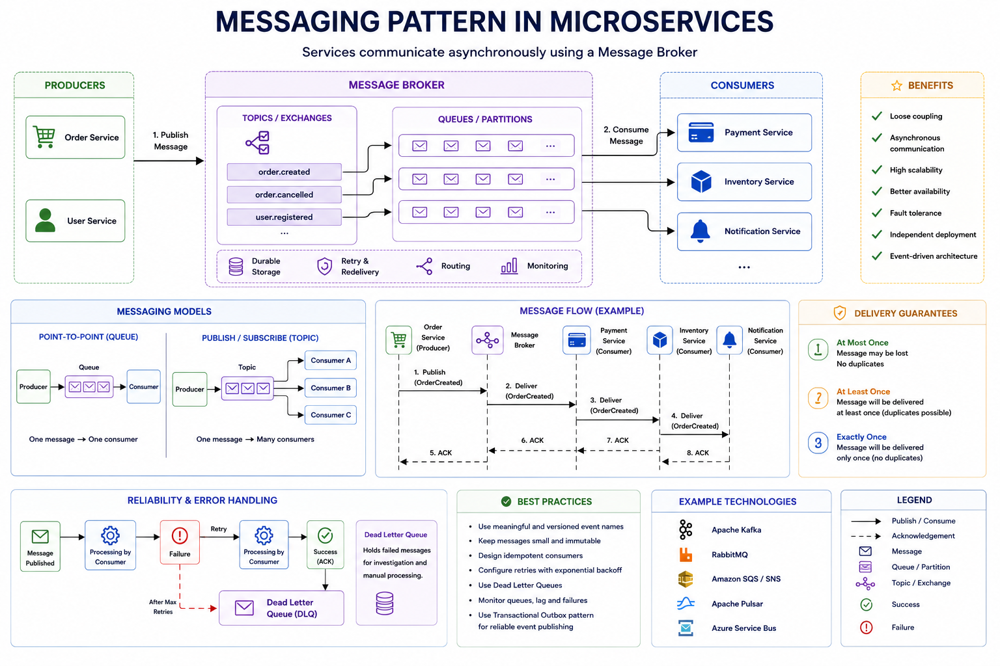

# Messaging Pattern

> A communication pattern where microservices exchange messages asynchronously through a Message Broker instead of calling each other directly.

---

# Table of Contents

- Overview
- Problem
- Solution
- Why Do We Need It?
- How It Works
- Architecture
- Components
- Messaging Models
- Delivery Guarantees
- Message Ordering
- Idempotency
- Dead Letter Queue (DLQ)
- Advantages
- Disadvantages
- When to Use
- When NOT to Use
- Common Mistakes
- Best Practices
- Related Patterns
- Spring Boot Example
- Interview Questions
- References

---

# Overview

In a microservices architecture, services communicate using one of two approaches:

- Synchronous Communication (REST, gRPC)
- Asynchronous Communication (Messaging)

Instead of directly calling another service, a producer publishes a message to a broker.

The broker is responsible for delivering the message to one or more consumers.

```
Producer

↓

Message Broker

↓

Consumer
```

Popular message brokers include:

- Apache Kafka
- RabbitMQ
- Amazon SQS
- Apache Pulsar
- ActiveMQ
- Azure Service Bus

---

# Problem

Suppose Order Service directly calls:

- Payment Service
- Inventory Service
- Notification Service

```
Order

↓

Payment

↓

Inventory

↓

Notification
```

Problems:

- Tight coupling
- Increased latency
- Cascading failures
- Difficult scaling
- Reduced availability

If Payment Service is unavailable, Order Service also fails.

---

# Solution

Introduce a Message Broker.

```
                 Order Service

                       │

               Publish Event

                       │

                       ▼

               Message Broker

          ┌──────────┼──────────┐
          │          │          │
          ▼          ▼          ▼

     Payment     Inventory   Notification
```

The producer doesn't know who consumes the message.

Services become loosely coupled.

---

# Why Do We Need It?

Messaging provides:

- Loose coupling
- High scalability
- Better availability
- Asynchronous processing
- Event-driven architecture
- Independent deployments
- Improved fault tolerance

---

# How It Works

1. Producer publishes a message.
2. Broker stores the message.
3. Consumer subscribes.
4. Consumer processes the message.
5. Broker receives acknowledgment.
6. Message is removed (or retained depending on the broker).
---
# Architecture



---

# Components

## Producer

Creates messages.

Example:

```
Order Service

↓

Order Created Event
```

---

## Message Broker

Responsible for:

- Storing messages
- Routing messages
- Retrying delivery
- Ordering (broker-dependent)
- Durability

Examples:

- Kafka
- RabbitMQ
- SQS

---

## Consumer

Receives and processes messages.

```
Payment Service

↓

Consume OrderCreated
```

---

# Messaging Models

## Point-to-Point (Queue)

One producer.

One consumer processes each message.

```
Producer

↓

Queue

↓

Consumer
```

Example:

RabbitMQ Queue

Amazon SQS

---

## Publish / Subscribe

One producer.

Multiple consumers.

```
Producer

↓

Topic

↓

Consumer A

Consumer B

Consumer C
```

Example:

Kafka Topic

RabbitMQ Fanout Exchange

---

# Delivery Guarantees

## At Most Once

```
Producer

↓

Broker

↓

Consumer
```

No retries.

Message may be lost.

---

## At Least Once

```
Producer

↓

Broker

↓

Retry Until ACK

↓

Consumer
```

Duplicates are possible.

Most commonly used.

---

## Exactly Once

Message is processed only once.

Usually requires:

- Kafka Transactions
- Idempotent Producer
- Transactional Consumer

Higher complexity.

---

# Message Ordering

Ordering depends on the broker.

Kafka:

Ordering is guaranteed **within a partition**.

RabbitMQ:

Ordering is guaranteed **within a queue**.

Multiple consumers may affect ordering.

---

# Idempotency

Consumers should be idempotent.

Example:

```
OrderCreated

↓

Consumer

↓

Database
```

If the same event arrives twice:

```
OrderCreated

↓

Consumer

↓

Already Processed

↓

Ignore
```

No duplicate side effects occur.

---

# Dead Letter Queue (DLQ)

Messages that repeatedly fail are moved to a separate queue.

```
Message

↓

Retry

↓

Retry

↓

Retry

↓

Dead Letter Queue
```

Allows investigation without blocking normal processing.

---

# Advantages

- Loose coupling
- High scalability
- Better fault tolerance
- Improved availability
- Independent deployment
- Supports Event-Driven Architecture

---

# Disadvantages

- Eventual consistency
- More infrastructure
- More operational complexity
- Harder debugging
- Duplicate message handling

---

# When to Use

✅ Event-driven systems

✅ Notifications

✅ Payment processing

✅ Order processing

✅ Background jobs

✅ Audit logging

✅ Analytics

✅ Integration between services

---

# When NOT to Use

❌ Immediate synchronous responses

❌ Simple CRUD applications

❌ Strong consistency requirements

❌ Request/response communication

---

# Common Mistakes

## Using Messaging Everywhere

Not every communication needs a message broker.

Simple request-response interactions are often better with REST or gRPC.

---

## Ignoring Idempotency

Messages may be delivered more than once.

Consumers must safely handle duplicates.

---

## No Dead Letter Queue

Failed messages should not be discarded.

Always configure a DLQ.

---

## Large Messages

Avoid sending files or large payloads.

Send identifiers and retrieve the data when needed.

---

## No Monitoring

Monitor:

- Queue depth
- Consumer lag
- Retry count
- Processing time
- DLQ size

---

# Best Practices

- Keep messages immutable.
- Use versioned event schemas.
- Design idempotent consumers.
- Configure retries.
- Configure Dead Letter Queues.
- Use Transactional Outbox for reliable publishing.
- Monitor consumer lag.
- Avoid oversized messages.

---

# Related Patterns

- Transactional Outbox
- Saga Pattern
- Event Sourcing
- CQRS
- Dead Letter Queue
- Idempotency
- Retry
- Circuit Breaker

---

# Spring Boot Example
(Soon)

# Interview Questions

### Why use messaging instead of REST?

Messaging provides asynchronous communication, loose coupling, better scalability, and improved fault tolerance.

---

### What is the difference between a Queue and a Topic?

**Queue**

- One consumer processes each message.

**Topic**

- Multiple consumers can receive the same message.

---

### What is consumer acknowledgment (ACK)?

An ACK tells the broker that the consumer has successfully processed the message.

---

### Why is idempotency important?

Because messages may be delivered more than once.

Consumers should produce the same result regardless of duplicate deliveries.

---

### What is a Dead Letter Queue?

A queue where messages are moved after exceeding the maximum retry attempts.

---

### Which delivery guarantee is most common?

**At Least Once**, because it offers a good balance between reliability and complexity.

---

### Which messaging systems are most popular?

- Apache Kafka
- RabbitMQ
- Amazon SQS