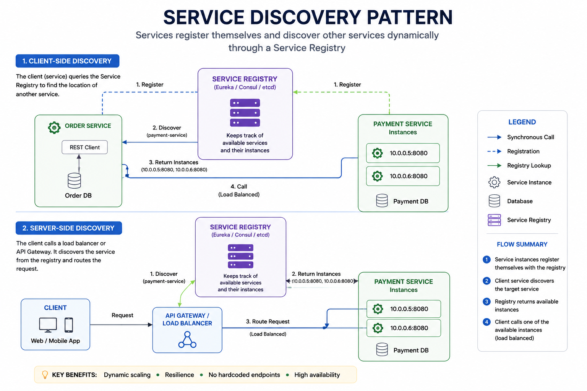

# Service Discovery Pattern

> A communication pattern that enables microservices to dynamically discover and communicate with each other without hardcoding service locations.

---

# Table of Contents

- Overview
- Problem
- Solution
- Why Do We Need It?
- Architecture
- Types of Service Discovery
- How It Works
- Example
- Advantages
- Disadvantages
- When to Use
- When NOT to Use
- Common Mistakes
- Best Practices
- Related Patterns
- Spring Boot Example
- Interview Questions

---

# Overview

In a microservices architecture, service instances are dynamic.

Instances may:

- Start
- Stop
- Scale out
- Scale in
- Change IP addresses

Hardcoding service URLs is not practical.

Service Discovery allows services to locate each other dynamically through a Service Registry.

---

# Problem

Without Service Discovery, services communicate using fixed IP addresses.

```
Order Service

↓

http://10.10.1.25:8080
```

Problems:

- IP addresses change.
- Containers restart.
- Kubernetes Pods are recreated.
- Auto Scaling changes the number of instances.
- Manual configuration becomes difficult.

---

# Solution

Introduce a Service Registry.

Services register themselves when they start.

Other services query the registry to locate them.

```
Order Service

↓

Service Registry

↓

Payment Service
```

No service needs to know another service's physical address.

---

# Why Do We Need It?

Service Discovery provides:

- Dynamic service lookup
- Automatic registration
- Load balancing
- Scalability
- Fault tolerance
- Reduced configuration
- Better resilience

---

# Architecture



---

# Types of Service Discovery

## Client-Side Discovery

The client queries the Service Registry.

```
Client

↓

Service Registry

↓

Payment Service
```

Examples:

- Netflix Eureka
- Consul

---

## Server-Side Discovery

The client sends requests to a Load Balancer.

The Load Balancer queries the Service Registry.

```
Client

↓

Load Balancer

↓

Service Registry

↓

Payment Service
```

Examples:

- Kubernetes
- AWS ELB
- NGINX
- Envoy

---

# How It Works

1. Payment Service starts.
2. Payment Service registers itself.
3. Order Service requests Payment Service.
4. Registry returns an available instance.
5. Order Service sends the request.

---

# Example

Without Service Discovery

```
Order Service

↓

http://10.0.0.12:8080
```

Hardcoded endpoint.

---

With Service Discovery

```
Order Service

↓

payment-service

↓

Registry

↓

10.0.0.12:8080
```

The IP is resolved automatically.

---

# Advantages

- Dynamic service locations
- Automatic scaling
- High availability
- Simplified configuration
- Better resilience
- Supports cloud-native applications

---

# Disadvantages

- Additional infrastructure
- Registry availability is critical
- More operational complexity
- Registration failures affect communication

---

# When to Use

✅ Kubernetes

✅ Docker Swarm

✅ Spring Cloud

✅ Dynamic cloud environments

✅ Large microservice systems

---

# When NOT to Use

❌ Monolithic applications

❌ Small applications with fixed endpoints

❌ Single backend service

---

# Common Mistakes

## Hardcoding Service URLs

Avoid storing service IP addresses in configuration files.

---

## Ignoring Health Checks

Unhealthy instances should not receive traffic.

---

## No Service Deregistration

Stopped instances must be removed from the registry.

---

## Registry as a Single Point of Failure

Deploy multiple registry instances.

---

## Using Discovery for External APIs

External services usually don't register themselves.

---

# Best Practices

- Enable health checks.
- Register automatically on startup.
- Deregister gracefully.
- Use load balancing.
- Secure the registry.
- Monitor registry health.
- Cache discovery results when appropriate.

---

# Related Patterns

- API Gateway
- Load Balancer
- Service Mesh
- Circuit Breaker
- Retry
- Sidecar Pattern

---

# Spring Boot Example

Spring Cloud Eureka(soon)

---

# Interview Questions

### What problem does Service Discovery solve?

It enables services to locate each other dynamically without hardcoded addresses.

---

### What is a Service Registry?

A centralized component where services register themselves and discover other services.

---

### What is the difference between Client-Side and Server-Side Discovery?

Client-Side Discovery:
The client queries the registry directly.

Server-Side Discovery:
A load balancer or proxy performs service discovery on behalf of the client.

---

### Is Service Discovery needed in Kubernetes?

Yes, but Kubernetes provides built-in service discovery using DNS and Services.

---

### Can Service Discovery provide load balancing?

Yes.

Client-side discovery often uses client-side load balancing (e.g., Spring Cloud LoadBalancer), while server-side discovery relies on infrastructure such as Kubernetes Services, NGINX, or cloud load balancers.

