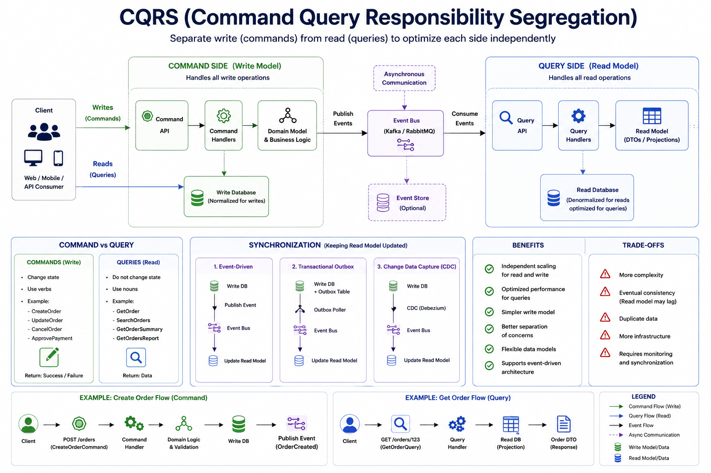

# CQRS (Command Query Responsibility Segregation)

> An architectural pattern that separates write operations (Commands) from read operations (Queries), allowing each side to be optimized independently.

---

# Table of Contents

- Overview
- Problem
- Solution
- Why Do We Need It?
- How It Works
- Architecture
- Command Side
- Query Side
- Synchronization
- CQRS with Event-Driven Architecture
- CQRS with Event Sourcing
- Advantages
- Disadvantages
- When to Use
- When NOT to Use
- Common Mistakes
- Best Practices
- Related Patterns
- Spring Boot Example
- Interview Questions
- References

---

# Overview

Traditional CRUD applications use the same model for both reading and writing data.

```
Client

↓

Application

↓

Database
```

As applications grow, read and write workloads often have different requirements.

For example:

- Writes require strong consistency and business validation.
- Reads require high performance and optimized queries.

CQRS solves this by separating the write model from the read model.

---

# Problem

Suppose an e-commerce application.

Order creation involves:

- Validation
- Business rules
- Inventory checks
- Payment processing

Reading orders requires:

- Search
- Pagination
- Filtering
- Sorting
- Reporting

Using one model for both concerns often results in:

- Complex entities
- Slow queries
- Difficult scaling
- Tight coupling

---

# Solution

Separate Commands from Queries.

```
               Client
                  │
      ┌───────────┴───────────┐
      │                       │
      ▼                       ▼
 Commands                  Queries
      │                       │
      ▼                       ▼
Command Model          Query Model
      │                       │
      ▼                       ▼
 Write Database        Read Database
```

Each side evolves independently.

---

# Why Do We Need It?

CQRS provides:

- Independent scaling
- Faster queries
- Simpler write model
- Better separation of concerns
- Optimized databases
- Better performance

---

# How It Works

## Command Side

Responsible for changing data.

Examples:

- Create Order
- Update Customer
- Cancel Order
- Approve Payment

Commands modify state.

---

## Query Side

Responsible for reading data.

Examples:

- Get Order
- Search Products
- Dashboard
- Reports

Queries never modify state.

---

# Architecture



---

# Command Side

Example:

```
Client

↓

POST /orders

↓

Order Service

↓

Business Validation

↓

Write Database
```

Responsibilities:

- Validation
- Business Rules
- Transactions
- Domain Logic

---

# Query Side

Example:

```
Client

↓

GET /orders

↓

Query Service

↓

Read Database
```

Responsibilities:

- Fast queries
- Filtering
- Pagination
- Reporting
- Search

---

# Synchronization

The Read Model must stay synchronized with the Write Model.

Common approaches:

## Event-Driven

```
Command

↓

Write Database

↓

Publish Event

↓

Update Read Model
```

---

## Transactional Outbox

```
Write Database

+

Outbox Event

↓

Kafka

↓

Read Model
```

---

## CDC (Debezium)

```
Database

↓

Transaction Log

↓

Debezium

↓

Read Database
```

---

# CQRS with Event-Driven Architecture

CQRS commonly works with messaging.

```
Order Created

↓

Kafka

↓

Inventory

↓

Read Database
```

Events keep read models synchronized.

---

# CQRS with Event Sourcing

CQRS and Event Sourcing are different patterns but often used together.

Without Event Sourcing:

```
Current State

↓

Database
```

With Event Sourcing:

```
Events

↓

Replay Events

↓

Current State
```

The Read Model is built from events.

---

# Advantages

- Independent scaling
- Optimized read performance
- Better separation of concerns
- Flexible data models
- Easier reporting
- Supports Event-Driven Architecture

---

# Disadvantages

- More complexity
- Eventual consistency
- Duplicate data
- More infrastructure
- Synchronization required

---

# When to Use

✅ Large systems

✅ Read-heavy applications

✅ Reporting systems

✅ Event-Driven Architecture

✅ High scalability

✅ Complex business logic

---

# When NOT to Use

❌ Small CRUD applications

❌ Simple internal tools

❌ Low traffic systems

❌ Applications requiring immediate consistency everywhere

---

# Common Mistakes

## Splitting Too Early

CQRS introduces complexity.

Do not use it unless you have a real need.

---

## Sharing the Same Model

Using the same entity for reads and writes defeats the purpose.

---

## Ignoring Eventual Consistency

The Read Model may lag behind the Write Model.

Applications must tolerate this.

---

## Poor Read Model Design

The read database should be optimized for queries.

Not normalized like the write database.

---

## No Event Versioning

Events evolve over time.

Version them properly.

---

# Best Practices

- Keep Commands and Queries separate.
- Use dedicated DTOs.
- Keep command handlers focused on business logic.
- Optimize the read database for queries.
- Use messaging for synchronization.
- Combine with Transactional Outbox.
- Monitor synchronization lag.
- Design for eventual consistency.

---

# Related Patterns

- Event Sourcing
- Transactional Outbox
- Change Data Capture (CDC)
- Saga Pattern
- API Composition
- Database per Service

---

# Spring Boot Example

Repository structure:
(Soon)

---

# Interview Questions

### What problem does CQRS solve?

It separates read and write responsibilities so each can be optimized independently.

---

### Does CQRS require two databases?

No.

CQRS separates the models.

The read and write sides can use:

- The same database
- Different schemas
- Different databases

Using separate databases is common but not mandatory.

---

### Is CQRS the same as Event Sourcing?

No.

CQRS separates reads and writes.

Event Sourcing stores events instead of current state.

They are independent patterns but often used together.

---

### Why is eventual consistency common in CQRS?

Because the Read Model is usually updated asynchronously from the Write Model.

---

### How is the Read Model updated?

Common approaches include:

- Kafka
- RabbitMQ
- Transactional Outbox
- CDC (Debezium)

---

### What are Commands?

Operations that change state.

Examples:

- Create Order
- Update Product
- Delete Customer

---

### What are Queries?

Operations that only read data.

Examples:

- Get Order
- Search Products
- Dashboard