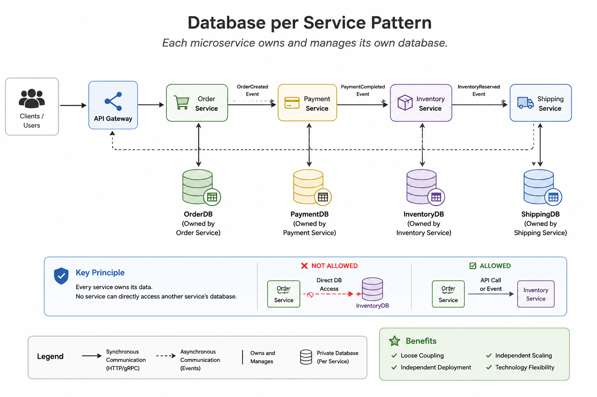

# Database per Service

> Each microservice owns and manages its own database. Other services must never access it directly.

---

# Table of Contents

- Overview
- Problem
- Solution
- Why Do We Need It?
- Architecture
- How It Works
- Example
- Advantages
- Disadvantages
- When to Use
- When NOT to Use
- Best Practices
- Related Patterns
- Spring Boot Example

---

# Overview

Database per Service is one of the fundamental Microservices Data Patterns.

Instead of sharing a single database, each microservice owns its own data store. Only the owning service can read or modify its data.

Other services must communicate through APIs or asynchronous events.

---

# Problem

In a monolithic application, multiple modules usually access the same database.

```
+----------------------+
|  Shared Database     |
+----------------------+
        ▲
        │
 ┌──────┼────────┐
 │      │        │
 ▼      ▼        ▼
Order Payment Inventory
```

This creates:

- Tight coupling
- Difficult deployments
- Schema conflicts
- Shared ownership
- Reduced scalability

---

# Solution

Each service owns its own database.

```
                 API/Event

+---------+      +---------+      +-----------+
| Order   | ---> | Payment | ---> | Inventory |
| Service |      | Service |      | Service   |
+---------+      +---------+      +-----------+
     │                │                 │
     ▼                ▼                 ▼
+---------+      +---------+      +-----------+
| OrderDB |      |PaymentDB|      |InventoryDB|
+---------+      +---------+      +-----------+
```

No service can directly query another service's database.

---

# Why Do We Need It?

This pattern provides:

- Independent deployments
- Independent schema evolution
- Better scalability
- Team autonomy
- Fault isolation
- Technology flexibility

Each team can choose the most appropriate database for its service.

Example:

- PostgreSQL
- MongoDB
- Redis
- Cassandra

---

# Architecture


---

# How It Works

Example:

1. Customer creates an order.
2. Order Service stores the order in OrderDB.
3. Order Service publishes `OrderCreated`.
4. Inventory Service receives the event.
5. Inventory Service updates InventoryDB.
6. Payment Service processes payment.

Notice that no service directly accesses another database.

---

# Example

❌ Wrong

```
Order Service
      │
      ▼
SELECT * FROM payment.transactions
```

The Order Service is querying the Payment database directly.

---

✅ Correct

```
Order Service
      │
      ▼
Payment Service API

or

Kafka Event
```

---

# Advantages

- Loose coupling
- Independent deployments
- Independent scaling
- Technology diversity (Polyglot Persistence)
- Better ownership
- Improved security

---

# Disadvantages

- Distributed transactions
- Eventual consistency
- More operational complexity
- More infrastructure
- Additional network communication

---

# When to Use

✅ Medium to large microservice architectures

✅ Multiple independent teams

✅ Independent deployments

✅ High scalability

---

# When NOT to Use

❌ Small applications

❌ Modular monolith

❌ Systems requiring strict ACID transactions across modules

---

# Best Practices

- One database owner
- Never share tables
- Use APIs or events
- Keep services autonomous
- Prefer asynchronous communication
- Use Saga for distributed transactions
- Use Transactional Outbox for reliable event publishing

---

# Related Patterns

- Saga Pattern
- CQRS
- Event Sourcing
- Transactional Outbox
- Change Data Capture (CDC)

---

# Spring Boot Example

Full implementation(Soon)

---

### What problems does this pattern solve?

- Tight coupling
- Independent deployment
- Independent scaling
- Team autonomy
