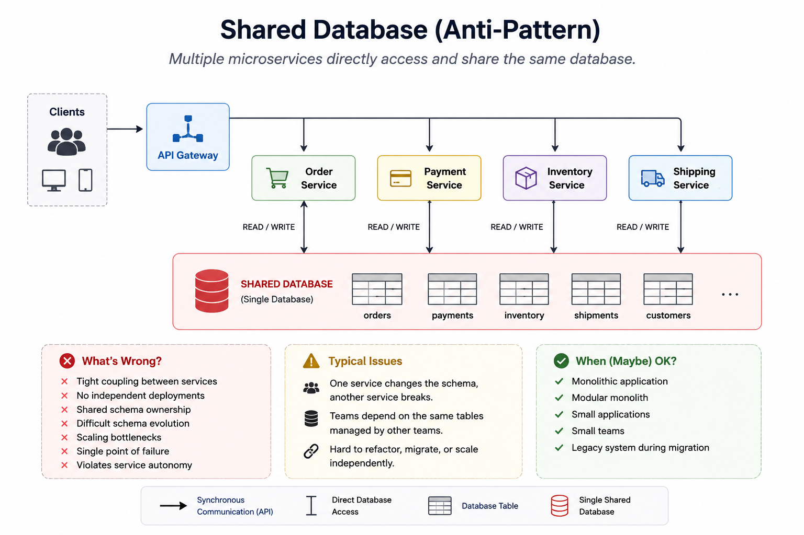

# Shared Database (anti-pattern)

> Multiple microservices directly access and share the same database, this is considered a common anti-pattern because it tightly couples services together, defeating one of the main goals of microservices.

---

# Table of Contents

- Overview
- Problem
- Solution
- Architecture
- How It Works
- Example
- Advantages
- Disadvantages
- When to Use
- When NOT to Use
- Best Practices
- Related Patterns
- Spring Boot Example

---

# Overview

The Shared Database pattern allows multiple microservices to read and write data from the same database.

Although simple to implement, it introduces tight coupling between services and breaks one of the fundamental principles of microservices: **service autonomy**.

For this reason, a shared database is generally considered an anti-pattern in modern microservice architectures.

---

# Problem

When a system is decomposed into microservices, teams often continue using the existing monolithic database.

As more services directly access the same database:

- Services become tightly coupled.
- Database schema changes become risky.
- Teams lose deployment independence.
- Cross-service dependencies increase.

---

# Solution

All services access the same database.

```

+-------------------+
| Shared Database |
+-------------------+
▲ ▲ ▲
│ │ │
│ │ └──────── Inventory Service
│ └────────── Payment Service
└──────────── Order Service

```

Each service can directly query and update shared tables.

---

# Architecture



---

# How It Works

Example:

1. Order Service inserts an order.
2. Payment Service reads the Orders table.
3. Inventory Service updates the same database.
4. Reporting Service joins data across multiple tables.

Every service depends on the same database schema.

---

# Example

✅ Allowed in this pattern

```

Order Service
│
▼
SELECT * FROM orders

```

```

Payment Service
│
▼
UPDATE orders
SET status='PAID'

```

Every service directly communicates with the same database.

---

# Advantages

- Simple architecture
- Easy to start
- No API communication required
- ACID transactions across modules
- Easy reporting using SQL JOINs
- Lower operational complexity

---

# Disadvantages

- Tight coupling
- No independent deployments
- Shared schema ownership
- Difficult schema evolution
- Scaling bottlenecks
- Technology lock-in
- Single point of failure
- Violates microservice autonomy

---

# When to Use

✅ Monolithic applications

✅ Modular monoliths

✅ Small teams

✅ Small systems

✅ Legacy systems during migration

---

# When NOT to Use

❌ Independent microservices

❌ Multiple autonomous teams

❌ Cloud-native architectures

❌ Systems requiring independent deployments

---

# Best Practices

If you must use a shared database:

- Clearly define table ownership.
- Restrict write access.
- Avoid cross-service updates.
- Plan migration toward Database per Service.
- Expose APIs instead of direct database access where possible.

---

# Related Patterns

- Database per Service
- Saga Pattern
- CQRS
- Transactional Outbox
- Anti-Corruption Layer
- Strangler Fig Pattern

---

# Spring Boot Example

Full implementation(Soon)

### What is the recommended alternative?

Database per Service.
