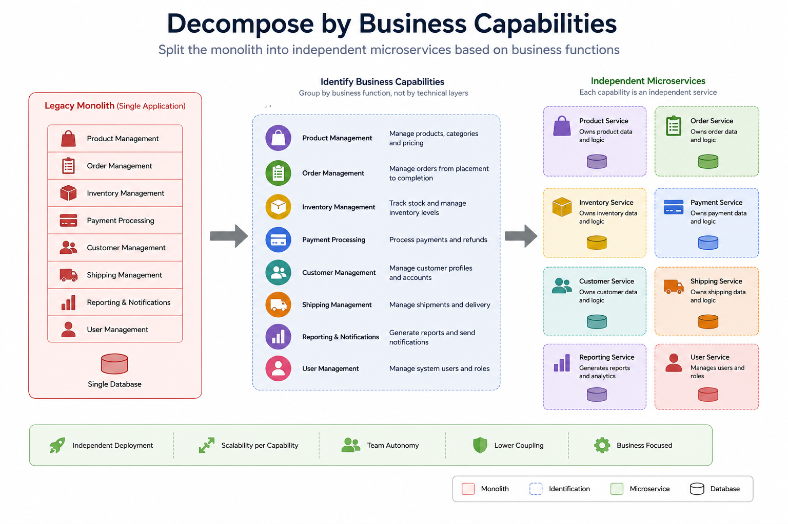

# Decompose by Business Capability Pattern

> A decomposition pattern that structures microservices around business capabilities, enabling each service to own a distinct business function with its own data, logic, and lifecycle.

---

# Table of Contents

- Overview
- Problem
- Solution
- Why Do We Need It?
- What is a Business Capability?
- How It Works
- Architecture
- Advantages
- Disadvantages
- When to Use
- When NOT to Use
- Common Mistakes
- Best Practices
- Related Patterns
- Spring Boot Example
- Interview Questions
- References

---

# Overview

One of the first challenges when adopting a microservices architecture is deciding **how to split a monolithic application**.

The **Decompose by Business Capability Pattern** addresses this by organizing services around **business capabilities** rather than technical layers.

A business capability represents a specific business function that an organization performs, such as:

- Order Management
- Customer Management
- Inventory Management
- Payment Processing
- Shipping

Each capability becomes an independent microservice responsible for its own business logic and data.

---

# Problem

Many monolithic applications are organized by technical layers:

```
Presentation Layer
Business Layer
Data Access Layer
Database
```

When migrating to microservices, teams often make the mistake of splitting services by technical components:

```
User Service
Database Service
Email Service
Validation Service
```

This leads to:

- Tight coupling
- Chatty communication
- Poor service boundaries
- Distributed monoliths
- Difficult deployments

---

# Solution

Instead of decomposing by technical responsibilities, decompose by **business capabilities**.

Example:

```
E-Commerce

├── Product Catalog
├── Order Management
├── Inventory
├── Payment
├── Shipping
└── Customer Management
```

Each business capability becomes an independent microservice.

Each service owns:

- Business logic
- Database
- APIs
- Deployment lifecycle

---

# Why Do We Need It?

Business capabilities:

- Rarely change
- Represent real business functions
- Align development teams with business domains
- Minimize coupling
- Improve scalability

This enables teams to work independently and deploy services without affecting unrelated parts of the system.

---

# What is a Business Capability?

A **business capability** is something the business does—not a technical component.

Examples:

| Business Capability | Microservice |
|---------------------|--------------|
| Product Catalog | Product Service |
| Order Management | Order Service |
| Payment Processing | Payment Service |
| Inventory Management | Inventory Service |
| Shipping | Shipping Service |
| Customer Management | Customer Service |

Notice these represent business functions rather than technologies.

---

# How It Works

1. Identify the organization's major business capabilities.
2. Define clear boundaries for each capability.
3. Create one microservice per capability.
4. Assign each service ownership of its business logic and data.
5. Allow services to communicate through APIs or asynchronous messaging.

---

# Architecture



---

# Example

Traditional Monolith

```
E-Commerce System

├── Products
├── Orders
├── Payments
├── Inventory
├── Customers
└── Shipping
```

↓

Business Capability Decomposition

```
                 API Gateway
                      │
      ┌───────────────┼───────────────┐
      ▼               ▼               ▼
 Product Service   Order Service   Customer Service
      │               │               │
      ▼               ▼               ▼
 Product DB       Order DB      Customer DB

             ▼
     Payment Service
             │
      Payment DB

             ▼
    Inventory Service
             │
     Inventory DB

             ▼
      Shipping Service
             │
      Shipping DB
```

---

# Advantages

- Clear service boundaries
- High cohesion
- Low coupling
- Independent deployments
- Independent scaling
- Easier maintenance
- Better team ownership
- Improved business alignment

---

# Disadvantages

- Requires a good understanding of the business domain
- Identifying boundaries can be challenging
- Initial decomposition may need refinement
- Cross-service communication increases

---

# When to Use

✅ Building a new microservices architecture

✅ Migrating a monolith

✅ Domain-driven organizations

✅ Large enterprise systems

✅ Teams organized around business functions

---

# When NOT to Use

❌ Small applications

❌ Simple CRUD systems

❌ Projects with a single development team and limited scalability requirements

---

# Common Mistakes

## Decomposing by Technical Layers

Avoid:

```
Authentication Service
Validation Service
Database Service
Logging Service
```

These are technical concerns, not business capabilities.

---

## Creating Services That Are Too Small

A service should represent a meaningful business capability.

Avoid splitting one capability into many tiny services.

---

## Sharing the Same Database

Each capability should own its data.

Avoid:

```
Order Service
Product Service
Payment Service

↓

Shared Database
```

Use **Database per Service** instead.

---

## Ignoring Business Boundaries

Microservices should reflect how the business operates, not how the code is organized.

---

# Best Practices

- Collaborate with domain experts.
- Start with coarse-grained services.
- Define clear ownership.
- Keep each service focused on one business capability.
- Let each service own its database.
- Use asynchronous communication where appropriate.
- Continuously refine service boundaries as the business evolves.

---

# Related Patterns

- Decompose by Subdomain
- Database per Service
- API Gateway
- Saga
- CQRS
- Strangler Fig

---

# Spring Boot Example

Repository structure:

```
springboot-microservices-examples/

decomposition/

└── decompose-by-business-capability/
    ├── README.md
    ├── architecture.png
    ├── docker-compose.yml
    ├── product-service/
    ├── order-service/
    ├── payment-service/
    ├── inventory-service/
    ├── shipping-service/
    └── customer-service/
```

This example demonstrates how an e-commerce monolith can be decomposed into independent Spring Boot microservices based on business capabilities.

---

# Interview Questions

### What is Decompose by Business Capability?

A decomposition pattern where microservices are organized around business functions rather than technical layers.

---

### Why is it preferred over technical decomposition?

Because business capabilities create natural service boundaries with high cohesion and low coupling, enabling independent development and deployment.

---

### What is a business capability?

A stable business function an organization performs, such as order management, payment processing, or inventory management.

---

### How is it different from Decompose by Subdomain?

- **Business Capability** focuses on the organization's business functions.
- **Decompose by Subdomain** is based on Domain-Driven Design (DDD) and identifies bounded contexts within the business domain.

---

### Should each business capability have its own database?

Yes. In a microservices architecture, this pattern is commonly combined with the **Database per Service** pattern so that each service owns its data.
