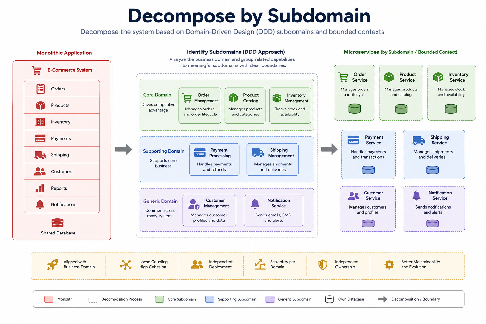

# Decompose by Subdomain Pattern

> A decomposition pattern that structures microservices around **Domain-Driven Design (DDD) subdomains and bounded contexts**, ensuring each service owns a well-defined business domain with its own model, logic, and data.

---

# Table of Contents

- Overview
- Problem
- Solution
- Why Do We Need It?
- What is a Subdomain?
- Core, Supporting, and Generic Subdomains
- How It Works
- Architecture
- Advantages
- Disadvantages
- When to Use
- When NOT to Use
- Common Mistakes
- Best Practices
- Related Patterns
- Spring Boot Example
- Interview Questions
- References

---

# Overview

As systems grow, simply splitting services by business capabilities may not be enough.

Large business capabilities often contain multiple business domains with different models, terminology, and business rules.

The **Decompose by Subdomain Pattern** uses **Domain-Driven Design (DDD)** to identify these domains and create microservices around **Bounded Contexts**.

Each subdomain becomes an autonomous microservice with its own:

- Business rules
- Domain model
- APIs
- Database
- Deployment lifecycle

---

# Problem

Suppose an e-commerce platform has a single **Order Management** capability.

Although it appears to be one capability, it actually contains multiple domains:

- Order Processing
- Payment
- Inventory
- Shipping
- Returns

If everything remains inside one service:

- The domain becomes difficult to understand.
- Teams interfere with each other.
- Business rules become tightly coupled.
- Scaling becomes difficult.
- Changes introduce unexpected side effects.

---

# Solution

Identify the application's **Subdomains** and their **Bounded Contexts**.

Each bounded context becomes its own microservice.

Instead of:

```
Order Service
```

Create:

```
Order Service
Payment Service
Inventory Service
Shipping Service
```

Each service owns its own domain model and data.

---

# Why Do We Need It?

Large systems naturally evolve into multiple business domains.

DDD helps us:

- Discover natural service boundaries.
- Reduce coupling.
- Increase cohesion.
- Improve maintainability.
- Align software with business terminology.

---

# What is a Subdomain?

A **Subdomain** is a distinct area of the business with its own terminology, business rules, and responsibilities.

Example:

```
E-Commerce

Core Domain
│
├── Ordering
├── Payment
└── Inventory

Supporting Domain
│
├── Notification
└── Reporting

Generic Domain
│
├── Authentication
└── Email
```

Each subdomain can become one or more bounded contexts.

---

# Core, Supporting, and Generic Subdomains

## Core Subdomain

The part of the business that provides competitive advantage.

Examples:

- Order Processing
- Pricing
- Recommendation Engine

This is where the business invests the most effort.

---

## Supporting Subdomain

Supports the core business but is not the main competitive differentiator.

Examples:

- Reporting
- Notifications
- Audit

---

## Generic Subdomain

Common functionality that exists in many systems.

Examples:

- Authentication
- Email
- File Storage

These are often implemented using existing frameworks or third-party services.

---

# How It Works

1. Analyze the business domain.
2. Identify subdomains.
3. Define bounded contexts.
4. Create one microservice for each bounded context.
5. Allow services to communicate using APIs or messaging.
6. Give each service ownership of its own data.

---

# Architecture



---

# Example

Traditional Monolith

```
E-Commerce

├── Orders
├── Payment
├── Inventory
├── Shipping
├── Customers
└── Reports
```

↓

DDD Subdomains

```
Core Domain
├── Order Service
├── Payment Service
└── Inventory Service

Supporting Domain
├── Shipping Service
└── Notification Service

Generic Domain
├── Authentication Service
└── Email Service
```

Each service owns:

- Domain Model
- Business Rules
- Database

---

# Advantages

- Natural service boundaries
- High cohesion
- Low coupling
- Clear ownership
- Easier maintenance
- Independent deployments
- Better scalability
- Aligns software with the business domain

---

# Disadvantages

- Requires Domain-Driven Design knowledge
- Domain discovery can be time-consuming
- Business experts are needed
- Initial boundaries may evolve over time

---

# When to Use

✅ Large enterprise systems

✅ Complex business domains

✅ Domain-Driven Design projects

✅ Long-term microservices initiatives

✅ Organizations with multiple development teams

---

# When NOT to Use

❌ Small CRUD applications

❌ Simple business domains

❌ Projects where DDD adds unnecessary complexity

---

# Common Mistakes

## Confusing Subdomains with Technical Layers

Avoid creating services like:

```
Database Service
Validation Service
Logging Service
```

These are technical concerns, not business domains.

---

## Creating a Service for Every Entity

Bounded contexts are **not** individual database tables.

Avoid:

```
Customer Service
Address Service
Phone Service
```

Instead, identify meaningful business domains.

---

## Sharing Domain Models

Each bounded context owns its own model.

Do not reuse entities across services.

---

## Ignoring Ubiquitous Language

Each bounded context should use terminology agreed upon by developers and domain experts.

---

# Best Practices

- Collaborate with domain experts.
- Identify bounded contexts before creating services.
- Keep each service focused on one domain.
- Let each service own its own database.
- Avoid sharing domain models.
- Use asynchronous communication when possible.
- Continuously refine boundaries as the business evolves.

---

# Related Patterns

- Decompose by Business Capability
- Database per Service
- API Gateway
- Saga
- CQRS
- Anti-Corruption Layer
- Strangler Fig

---

# Spring Boot Example

Repository structure:

```
springboot-microservices-examples/

decomposition/

└── decompose-by-subdomain/
    ├── README.md
    ├── architecture.png
    ├── docker-compose.yml
    ├── order-service/
    ├── payment-service/
    ├── inventory-service/
    ├── shipping-service/
    ├── notification-service/
    └── authentication-service/
```

This example demonstrates decomposing a monolithic e-commerce application into Spring Boot microservices based on **DDD subdomains and bounded contexts**.

---

# Interview Questions

### What is Decompose by Subdomain?

A decomposition pattern that structures microservices around **DDD subdomains and bounded contexts**, allowing each service to own a specific business domain.

---

### What is the difference between a Business Capability and a Subdomain?

A **Business Capability** describes **what the business does** (e.g., Order Management).

A **Subdomain** represents a **specific domain model and business language** within that capability, identified using Domain-Driven Design.

---

### What is a Bounded Context?

A Bounded Context defines the boundary within which a particular domain model and ubiquitous language are valid. In microservices, each bounded context often maps to a single service.

---

### Should every subdomain become a microservice?

Not necessarily.

Small subdomains may remain together initially. Service boundaries should consider business needs, team ownership, scalability, and operational complexity.

---

### Which DDD concepts are most important for this pattern?

- Subdomains
- Bounded Contexts
- Ubiquitous Language
- Aggregate
- Domain Model