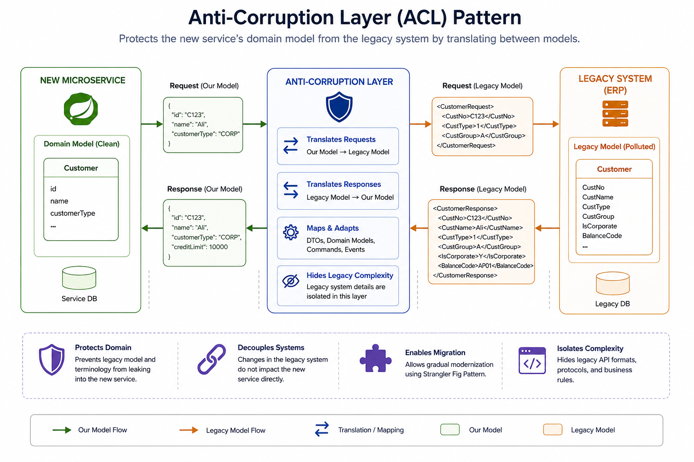

# Anti-Corruption Layer (ACL) Pattern

> A migration and integration pattern that protects a modern microservice from the domain model, APIs, and business rules of a legacy system by introducing a translation layer between them.

---

# Table of Contents

- Overview
- Problem
- Solution
- Why Do We Need It?
- How It Works
- Architecture
- Advantages
- Disadvantages
- When to Use
- When NOT to Use
- Common Mistakes
- Best Practices
- Related Patterns
- Spring Boot Example
- Interview Questions
- References

---

# Overview

The **Anti-Corruption Layer (ACL)** is a pattern from **Domain-Driven Design (DDD)** that is widely used in microservices, especially during legacy system modernization.

Instead of allowing a microservice to directly depend on a legacy system's APIs or domain model, an Anti-Corruption Layer sits between them and translates requests, responses, commands, events, and domain objects.

Its primary goal is to prevent the legacy model from "corrupting" the new domain model.

---

# Problem

Suppose you're migrating an old ERP system.

The legacy system exposes:

```
Customer
├── CustNo
├── CustType
├── CustGroup
├── IsCorporate
└── BalanceCode
```

Your new Order Service wants:

```
Customer
├── id
├── name
└── customerType
```

If the Order Service directly consumes the ERP model:

- Business logic becomes coupled to the ERP.
- Legacy terminology spreads into new services.
- Future ERP changes break your services.
- Your clean domain model becomes polluted.

---

# Solution

Introduce an **Anti-Corruption Layer**.

The ACL translates between:

- Requests
- Responses
- DTOs
- Domain Models
- Commands
- Events

Neither system knows about the other's internal model.

---

# Why Do We Need It?

The ACL helps:

- Protect the domain model
- Decouple new services from legacy systems
- Simplify future migrations
- Hide legacy complexity
- Improve maintainability

---

# How It Works

1. Order Service needs customer information.
2. It calls the ACL.
3. ACL calls the ERP.
4. ERP returns its legacy model.
5. ACL translates the response.
6. Order Service receives its own domain model.

---

# Architecture



---

# What Can the ACL Translate?

## DTOs

Legacy DTO

↓

Modern DTO

---

## Domain Models

Legacy Entity

↓

Domain Entity

---

## Commands

Legacy Command

↓

Modern Command

---

## Events

Legacy Event

↓

Domain Event

---

## API Contracts

SOAP

↓

REST

or

REST

↓

gRPC

---

# Advantages

- Protects the domain model
- Reduces coupling
- Simplifies migration
- Isolates legacy changes
- Cleaner architecture
- Easier testing
- Better maintainability

---

# Disadvantages

- Additional layer
- More code
- Mapping complexity
- Slight latency

---

# When to Use

✅ Legacy system integration

✅ ERP integration

✅ CRM integration

✅ Third-party APIs

✅ Large modernization projects

✅ Strangler Fig migrations

---

# When NOT to Use

❌ Communication between two services that already share the same domain language

❌ Small applications

❌ Greenfield systems

---

# Common Mistakes

## Calling the Legacy System Directly

Avoid:

```
Order Service

↓

Legacy ERP
```

This tightly couples the service to the legacy model.

---

## Reusing Legacy DTOs

Never expose legacy objects inside the new microservice.

Always map them.

---

## Putting Business Logic Inside the ACL

The ACL should only:

- Translate
- Adapt
- Map

Business logic belongs inside the microservice.

---

## Making the ACL Generic

Each integration should have its own ACL.

Avoid creating one huge "integration service."

---

# Best Practices

- Keep translation logic isolated.
- Use dedicated mappers.
- Hide legacy APIs completely.
- Translate both requests and responses.
- Keep the ACL stateless.
- Unit test all mappings.
- Do not leak legacy terminology.

---

# Related Patterns

- Strangler Fig
- Adapter
- API Gateway
- Backend for Frontend (BFF)
- Saga

---

# Spring Boot Example
(Soon)

---

# Interview Questions

### What is an Anti-Corruption Layer?

A translation layer that protects a modern application's domain model from legacy systems or external bounded contexts.

---

### Why is it called "Anti-Corruption"?

Because it prevents the legacy domain model, terminology, and business rules from "corrupting" the new domain model.

---

### Is ACL only for legacy systems?

No.

It can also be used when integrating with:

- Third-party APIs
- External bounded contexts
- Different domain models

---

### Is ACL the same as Adapter?

No.

An **Adapter** changes one interface into another.

An **Anti-Corruption Layer** translates entire domain models and business concepts while protecting the application's domain.

---

### Which pattern is commonly used together with ACL?

The **Strangler Fig Pattern**, where newly extracted microservices communicate with the remaining legacy monolith through an ACL during gradual migration.