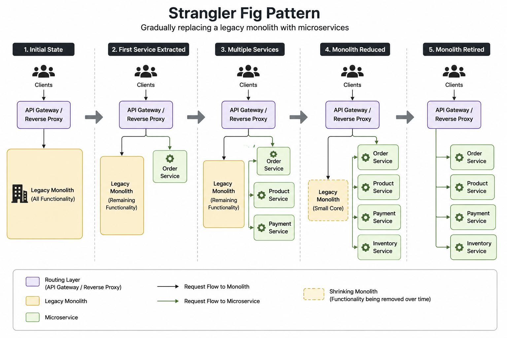

# Strangler Fig Pattern

> A migration pattern that gradually replaces a legacy monolithic application with microservices by incrementally routing functionality to new services until the monolith can be safely retired.

---

# Table of Contents

- Overview
- Problem
- Solution
- Why Do We Need It?
- How It Works
- Architecture
- Migration Flow
- Advantages
- Disadvantages
- When to Use
- When NOT to Use
- Common Mistakes
- Best Practices
- Related Patterns
- Spring Boot Example
- Interview Questions
- References

---

# Overview

The **Strangler Fig Pattern** is an incremental migration strategy for modernizing legacy applications.

Instead of rewriting the entire monolith at once, new features or business capabilities are gradually implemented as independent microservices. Incoming requests are routed either to the legacy application or to the new microservices until the monolith is completely replaced.

The pattern is named after the **Strangler Fig tree**, which slowly grows around another tree until it completely replaces it.

---

# Problem

Many organizations have large monolithic applications that:

- Are difficult to maintain
- Have slow deployment cycles
- Scale poorly
- Contain tightly coupled modules
- Carry significant technical debt

Rewriting the entire application from scratch is risky because:

- It requires a long development period.
- Business features stop evolving.
- The project may fail before completion.
- High cost and high risk.

---

# Solution

Gradually migrate the application.

Instead of replacing everything at once:

1. Place a routing layer in front of the monolith.
2. Select one business capability.
3. Implement it as a microservice.
4. Route only that functionality to the new service.
5. Leave the remaining requests handled by the monolith.
6. Repeat until the monolith is retired.

---

# Why Do We Need It?

The Strangler Fig Pattern enables organizations to:

- Reduce migration risk
- Deliver business value continuously
- Deploy new services independently
- Modernize incrementally
- Avoid "Big Bang" rewrites

---

# How It Works

1. Client sends a request.
2. API Gateway (or Reverse Proxy) receives it.
3. If the functionality has already been migrated, route to the microservice.
4. Otherwise, route to the legacy monolith.
5. Continue migrating one capability at a time.

Eventually:

```
Monolith

↓

Smaller Monolith

↓

Mostly Microservices

↓

Monolith Removed
```

---

# Architecture




---

# Migration Flow

### Phase 1

```
Client
   │
   ▼
API Gateway
   │
   ▼
Legacy Monolith
```

---

### Phase 2

```
                 Client
                    │
                    ▼
             API Gateway
             ┌──────────────┐
             ▼              ▼
      Legacy Monolith   Order Service
```

---

### Phase 3

```
                 Client
                    │
                    ▼
             API Gateway
        ┌──────┼──────────┐
        ▼      ▼          ▼
 Product   Order      Payment
 Service   Service    Service

        ▼
Remaining Monolith
```

---

### Final Phase

```
Client
   │
   ▼
API Gateway
   │
Microservices Only
```

The legacy application has been completely removed.

---

# Advantages

- Low migration risk
- Incremental modernization
- Continuous delivery
- Faster releases
- Easier rollback
- Business continuity
- Independent deployment
- Smaller migration scope

---

# Disadvantages

- Temporary architectural complexity
- Need to maintain two systems
- Routing layer required
- Data synchronization may be needed
- Longer migration timeline

---

# When to Use

✅ Migrating a large monolith

✅ Legacy modernization

✅ Incremental migration

✅ Business-critical applications

✅ Long-lived enterprise systems

---

# When NOT to Use

❌ Small applications

❌ Greenfield projects

❌ Applications that can be safely rewritten in a short time

---

# Common Mistakes

## Migrating Too Much at Once

Move one business capability at a time.

---

## Splitting by Technical Layers

Avoid:

- User Service
- Database Service
- Validation Service

Instead split by business capability.

---

## Sharing the Same Database Forever

Initially this may be unavoidable.

Eventually each microservice should own its own database.

---

## Leaving the Monolith Untouched

As new capabilities are migrated:

- Remove duplicated code.
- Reduce dependencies.
- Shrink the monolith continuously.

---

## No Migration Strategy

Migration should follow a clear roadmap.

Choose bounded contexts one by one.

---

# Best Practices

- Migrate one bounded context at a time.
- Place an API Gateway in front of the application.
- Use feature flags if needed.
- Monitor traffic during migration.
- Keep services independent.
- Remove legacy code after successful migration.
- Minimize shared databases.
- Use Anti-Corruption Layer when integrating with legacy systems.

---

# Related Patterns

- Anti-Corruption Layer
- API Gateway
- Database per Service
- Saga
- CQRS

---

# Spring Boot Example
(Soon)

---

# Interview Questions

### What is the Strangler Fig Pattern?

A migration pattern that gradually replaces a monolithic application with microservices by routing functionality incrementally to new services.

---

### Why is it called Strangler Fig?

It is inspired by the Strangler Fig tree, which slowly grows around another tree until it completely replaces it.

---

### What problem does it solve?

It reduces the risk of migrating legacy systems by avoiding a complete rewrite.

---

### Is the monolith removed immediately?

No.

It is gradually reduced until no functionality remains.

---

### What infrastructure is commonly used?

- API Gateway
- Reverse Proxy
- Load Balancer
- Feature Flags

---

### Can the monolith and microservices coexist?

Yes.

This is the core idea of the pattern.

---

### Which pattern is commonly used together with Strangler Fig?

**Anti-Corruption Layer (ACL)** to prevent legacy models and APIs from leaking into the new microservices.