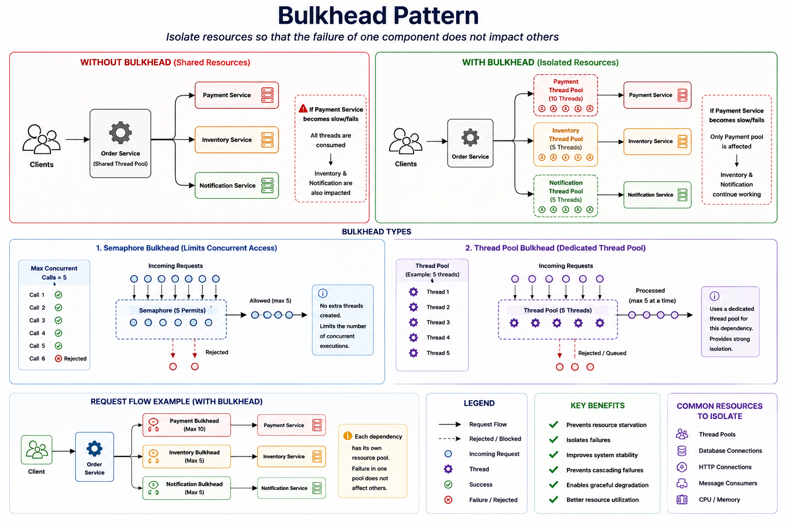

# Bulkhead Pattern

> A resilience pattern that isolates resources so that the failure of one component does not impact the availability of other components.

---

# Table of Contents

- Overview
- Problem
- Solution
- Why Do We Need It?
- How It Works
- Bulkhead Types
- Architecture
- Request Flow
- Failure Scenarios
- Advantages
- Disadvantages
- When to Use
- When NOT to Use
- Common Mistakes
- Best Practices
- Related Patterns
- Spring Boot Example
- Interview Questions

---

# Overview

In a distributed system, multiple services often share the same resources, such as:

- Thread Pools
- Database Connections
- HTTP Connection Pools
- Message Consumers
- Memory
- CPU

If one dependency becomes slow or unavailable, it can consume all shared resources and prevent healthy components from functioning.

The **Bulkhead Pattern** isolates resources into independent pools so that failures remain contained.

---

# Problem

Suppose **Order Service** communicates with three downstream services:

- Payment Service
- Inventory Service
- Notification Service

Without isolation, they all share the same thread pool.

```
                    Order Service

               Shared Thread Pool

                      │
      ┌───────────────┼───────────────┐
      │               │               │
      ▼               ▼               ▼
 Payment        Inventory      Notification
```

Now imagine **Payment Service** becomes very slow.

```
Shared Thread Pool

████████████████████

20 / 20 Threads Busy
```

Result:

- Payment requests block all threads.
- Inventory requests cannot execute.
- Notification requests cannot execute.
- The entire application appears unavailable.

This is known as **Resource Starvation**.

---

# Solution

Allocate dedicated resources for each dependency.

```
                    Order Service

        ┌────────────┬────────────┬────────────┐
        │            │            │
        ▼            ▼            ▼

 Payment Pool   Inventory Pool   Notification Pool
```

If Payment becomes unavailable:

```
Payment Pool

██████████

10 / 10 Busy
```

Inventory still has available resources.

```
Inventory Pool

██░░░░░

2 / 5 Busy
```

Notification also continues working.

Only the Payment functionality is affected.

---

# Why Do We Need It?

Bulkhead provides:

- Fault isolation
- Prevents cascading failures
- Protects system resources
- Improves availability
- Better resource utilization
- Graceful degradation

---

# How It Works

1. Divide resources into independent pools.
2. Assign each dependency its own pool.
3. Requests use only their assigned resources.
4. If one pool becomes exhausted, other pools remain unaffected.

---

# Bulkhead Types

## Semaphore Bulkhead

Limits the number of concurrent executions.

```
Max Concurrent Calls = 5

Call 1 ✅

Call 2 ✅

Call 3 ✅

Call 4 ✅

Call 5 ✅

Call 6 ❌ Rejected
```

Characteristics:

- Lightweight
- No additional threads
- Limits concurrent requests

---

## Thread Pool Bulkhead

Allocates a dedicated thread pool.

```
Payment Thread Pool

Thread 1

Thread 2

Thread 3

Thread 4

Thread 5
```

Inventory has its own thread pool.

```
Inventory Thread Pool

Thread 1

Thread 2

Thread 3
```

If Payment threads become blocked, Inventory threads continue processing requests.

---

# Architecture



---

# Request Flow

```
Client

↓

Order Service

↓

Payment Bulkhead

↓

Payment Service
```

Inventory requests use a different Bulkhead.

---

# Failure Scenarios

## Slow Payment Service

```
Payment Pool

██████████

Busy
```

Inventory continues serving requests.

---

## Inventory Failure

Inventory resources become exhausted.

Payment continues operating normally.

---

## Notification Timeout

Only Notification requests are delayed.

Payment and Inventory continue processing.

---

## Shared Pool (Without Bulkhead)

```
Shared Pool

████████████████████

All Requests Blocked
```

Entire application becomes degraded.

---

# Advantages

- Prevents resource starvation
- Improves fault isolation
- Prevents cascading failures
- Better resource utilization
- Higher availability
- Graceful degradation

---

# Disadvantages

- More configuration
- Increased complexity
- Requires capacity planning
- Incorrect pool sizing may waste resources

---

# When to Use

✅ External REST APIs

✅ gRPC services

✅ Database access

✅ Payment gateways

✅ Email providers

✅ Third-party integrations

✅ Long-running operations

---

# When NOT to Use

❌ Simple CRUD applications

❌ Applications with no external dependencies

❌ Local method calls

---

# Common Mistakes

## One Shared Thread Pool

Using one pool for every dependency defeats the purpose of Bulkhead.

---

## Oversized Pools

Very large pools increase memory usage and reduce isolation.

---

## Undersized Pools

Pools that are too small may reject requests unnecessarily.

---

## Forgetting Timeouts

Blocked threads remain occupied longer than necessary.

Always configure request timeouts.

---

## Using Thread Pool Bulkhead Everywhere

Many scenarios only require a Semaphore Bulkhead.

Choose the simplest option that meets your needs.

---

# Best Practices

- Isolate each external dependency.
- Configure request timeouts.
- Combine with Circuit Breaker.
- Combine with Retry for transient failures.
- Monitor pool utilization.
- Tune pool sizes using production metrics.
- Avoid sharing pools between unrelated services.

---

# Related Patterns

- Circuit Breaker
- Retry
- Timeout
- Fallback
- Rate Limiting
- Health Check

---

# Spring Boot Example

(Soon)

---

# Interview Questions

### What problem does the Bulkhead Pattern solve?

It prevents one failing or slow dependency from consuming all shared resources and affecting unrelated operations.

---

### What resources can be isolated?

- Thread Pools
- Database Connection Pools
- HTTP Connection Pools
- Message Consumers
- CPU
- Memory

---

### What is the difference between Semaphore Bulkhead and Thread Pool Bulkhead?

**Semaphore Bulkhead**

- Limits concurrent executions
- No extra thread pool
- Lower overhead

**Thread Pool Bulkhead**

- Uses a dedicated thread pool
- Provides stronger isolation
- Higher resource usage

---

### Does Bulkhead prevent service failures?

No.

It limits the impact of failures by isolating resources.

---

### Can Bulkhead replace Circuit Breaker?

No.

Bulkhead isolates resources.

Circuit Breaker stops calling unhealthy services.

They are complementary patterns.

---

### Which library is commonly used in Spring Boot?

Resilience4j Bulkhead