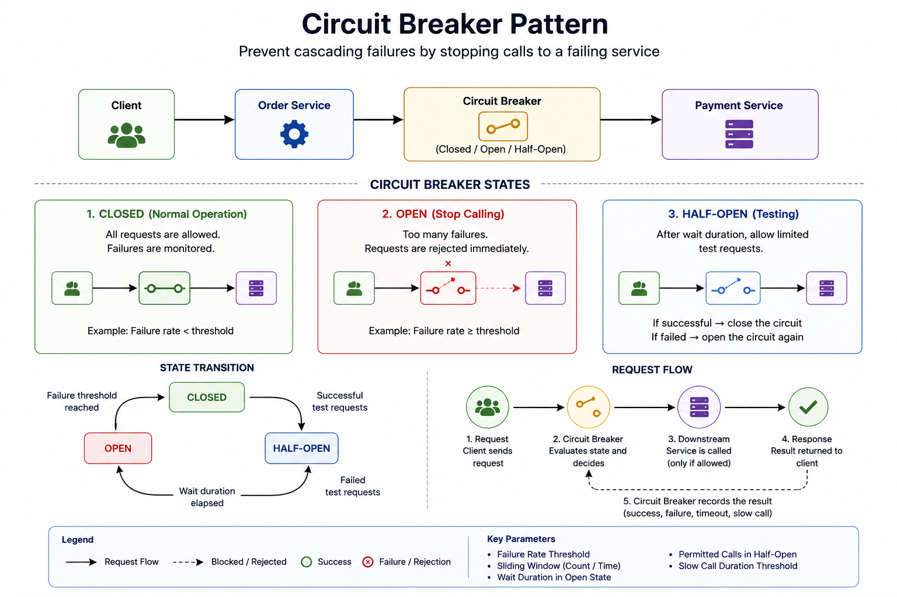

# Circuit Breaker Pattern

> A resilience pattern that prevents cascading failures(repeated calls to a failing service) by temporarily stopping requests until the service recovers.

---

# Table of Contents

- Overview
- Problem
- Solution
- Why Do We Need It?
- How It Works
- Circuit Breaker States
- Architecture
- Request Flow
- Configuration Parameters
- Failure Scenarios
- Advantages
- Disadvantages
- When to Use
- When NOT to Use
- Common Mistakes
- Best Practices
- Related Patterns
- Spring Boot Example
- Interview Questions

---

# Overview

In a microservices architecture, services communicate over the network using REST, gRPC, or messaging.

Unlike local method calls, network calls can fail due to:

- Network latency
- Service downtime
- High traffic
- Timeouts
- Infrastructure failures

Without protection, applications continue sending requests to unhealthy services, leading to cascading failures.

The Circuit Breaker Pattern detects failures and temporarily blocks requests until the downstream service becomes healthy again.

---

# Problem

Suppose **Order Service** calls **Payment Service**.

```
Client

↓

Order Service

↓

Payment Service
```

If Payment Service becomes unavailable:

```
Request

↓

Timeout

↓

Retry

↓

Timeout

↓

Retry

↓

Timeout
```

Every request waits for the timeout.

This causes:

- Blocked threads
- Increased response time
- Resource exhaustion
- Cascading failures
- Poor user experience

---

# Solution

Place a Circuit Breaker between the caller and the downstream service.

```
Order Service

↓

Circuit Breaker

↓

Payment Service
```

The Circuit Breaker continuously monitors requests.

If failures exceed a configured threshold, it opens the circuit and immediately rejects new requests instead of forwarding them to the unhealthy service.

---

# Why Do We Need It?

Circuit Breaker provides:

- Fault tolerance
- Faster failure responses
- Prevents cascading failures
- Protects thread pools
- Reduces unnecessary network traffic
- Improves system stability
- Supports graceful degradation

---

# How It Works

1. Requests are sent normally.
2. The Circuit Breaker records successes and failures.
3. If failures exceed the configured threshold, the circuit opens.
4. Incoming requests are rejected immediately.
5. After a waiting period, a few test requests are allowed.
6. If they succeed, the circuit closes.
7. Otherwise, it returns to the Open state.

---

# Circuit Breaker States

## Closed

Normal operation.

```
Client

↓

Circuit Breaker (Closed)

↓

Payment Service
```

All requests are allowed.

Failures are monitored.

---

## Open

Failure threshold exceeded.

```
Client

↓

Circuit Breaker (Open)

↓

Request Rejected
```

No requests reach the downstream service.

---

## Half-Open

After the configured waiting period:

```
Client

↓

Circuit Breaker (Half-Open)

↓

Limited Test Requests

↓

Payment Service
```

If successful:

```
Half-Open

↓

Closed
```

If failures continue:

```
Half-Open

↓

Open
```

---

# State Transition

```
                CLOSED
                   │
      Failure Threshold Reached
                   │
                   ▼
                 OPEN
                   │
        Wait Duration Elapses
                   │
                   ▼
              HALF-OPEN
               │       │
        Success        Failure
           │              │
           ▼              ▼
        CLOSED          OPEN
```

---

# Architecture


---

# Request Flow

```
Client

↓

Order Service

↓

Circuit Breaker

↓

Payment Service

↓

Response

↓

Circuit Breaker Records Result
```

---

# Configuration Parameters

## Failure Rate Threshold

Percentage of failed requests required to open the circuit.

Example:

```
50%
```

---

## Sliding Window

Defines how failures are measured.

### Count-Based

```
Last 100 Requests
```

### Time-Based

```
Last 60 Seconds
```

---

## Wait Duration in Open State

Time before transitioning from Open to Half-Open.

Example:

```
30 Seconds
```

---

## Permitted Calls in Half-Open

Number of test requests allowed.

Example:

```
5 Requests
```

---

## Slow Call Threshold

Requests slower than a configured duration may also count as failures.

Example:

```
2 Seconds
```

---

# Failure Scenarios

## Service Down

```
Request

↓

Connection Refused
```

---

## Timeout

```
Request

↓

Timeout
```

---

## High Failure Rate

```
100 Requests

↓

60 Failures

↓

Circuit Opens
```

---

## Recovery

```
Wait Duration

↓

Half-Open

↓

Success

↓

Closed
```

---

# Advantages

- Prevents cascading failures
- Improves system stability
- Protects system resources
- Reduces latency during outages
- Improves fault tolerance
- Supports graceful degradation

---

# Disadvantages

- Additional complexity
- Requires proper configuration
- Incorrect thresholds may reject healthy services
- Requires monitoring

---

# When to Use

✅ REST API calls

✅ gRPC communication

✅ Database calls

✅ Payment gateways

✅ Email providers

✅ Third-party services

✅ Microservice-to-microservice communication

---

# When NOT to Use

❌ Local method calls

❌ In-memory operations

❌ CPU-bound algorithms

❌ Operations that never leave the application process

---

# Common Mistakes

## Using Retry Without Circuit Breaker

Repeated retries against an unhealthy service increase system load.

---

## Opening the Circuit Too Quickly

Very small sample sizes can produce false positives.

---

## Waiting Too Long Before Recovery

Long Open durations delay recovery.

---

## Ignoring Slow Calls

Slow responses can exhaust resources even when they eventually succeed.

---

## Missing Monitoring

Always monitor:

- Failure Rate
- Slow Call Rate
- Open Circuit Count
- Rejected Requests
- Response Time

---

# Best Practices

- Configure request timeouts.
- Use Retry together with Circuit Breaker when appropriate.
- Provide fallback responses where possible.
- Monitor Circuit Breaker metrics.
- Tune thresholds using production traffic.
- Protect each remote dependency independently.
- Avoid sharing one Circuit Breaker across unrelated services.

---

# Related Patterns

- Retry Pattern
- Timeout Pattern
- Bulkhead Pattern
- Fallback Pattern
- Rate Limiting Pattern
- Health Check Pattern
- Service Mesh

---

# Spring Boot Example
(Soon)

---

# Interview Questions

### What problem does the Circuit Breaker Pattern solve?

It prevents repeated requests to an unhealthy service and protects the system from cascading failures.

---

### What are the three Circuit Breaker states?

- Closed
- Open
- Half-Open

---

### What causes the circuit to open?

When the configured failure threshold is exceeded.

---

### Why is the Half-Open state important?

It allows a limited number of requests to verify whether the downstream service has recovered.

---

### What is the difference between Retry and Circuit Breaker?

Retry attempts failed requests again.

Circuit Breaker stops sending requests to a service that is consistently failing.

---

### Does Circuit Breaker replace request timeouts?

No.

Timeouts detect slow or unresponsive requests.

Circuit Breaker uses failures and slow calls to determine when to stop sending requests.

---

### Which library is commonly used in Spring Boot?

Resilience4j
