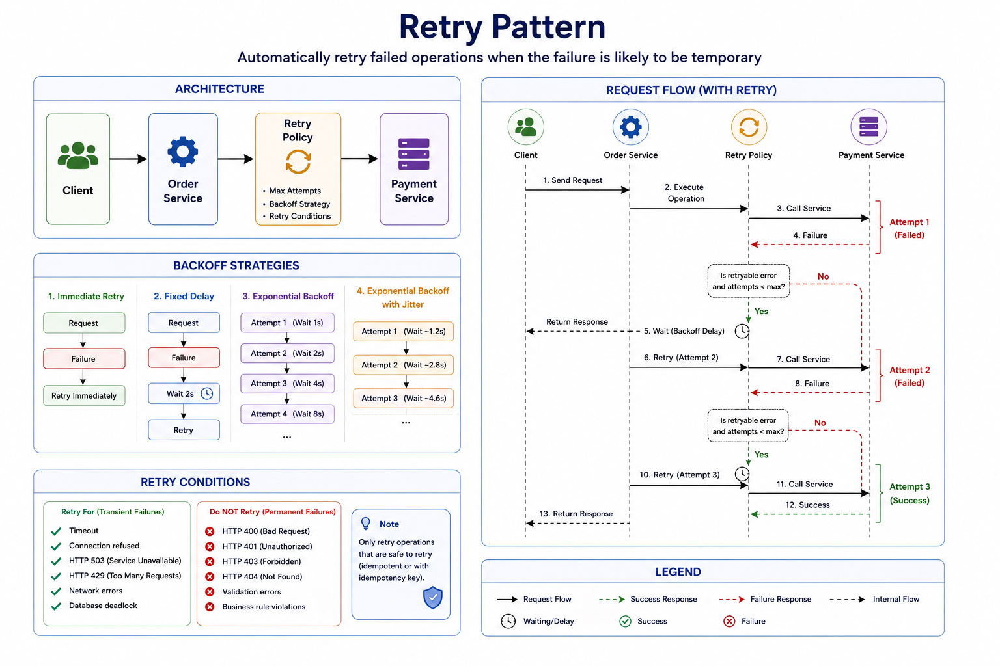

# Retry Pattern

> A resilience pattern that automatically retries failed operations when the failure is likely to be temporary.

---

# Table of Contents

- Overview
- Problem
- Solution
- Why Do We Need It?
- How It Works
- Retry Strategies
- Retry Conditions
- Architecture
- Request Flow
- Backoff Strategies
- Failure Scenarios
- Advantages
- Disadvantages
- When to Use
- When NOT to Use
- Common Mistakes
- Best Practices
- Related Patterns
- Spring Boot Example
- Interview Questions
- References

---

# Overview

Distributed systems frequently experience transient failures.

Examples include:

- Temporary network issues
- Short service outages
- Database deadlocks
- Connection resets
- Rate limiting
- Timeout exceptions

These failures often resolve themselves after a short period.

Instead of immediately failing the request, the Retry Pattern automatically attempts the operation again.

---

# Problem

Suppose **Order Service** calls **Payment Service**.

```
Order Service

↓

Payment Service

↓

Timeout
```

Without Retry:

```
Request

↓

Failure

↓

Return Error
```

Although the failure may only last a few milliseconds, the request still fails.

---

# Solution

Automatically retry the operation.

```
Request

↓

Failure

↓

Retry #1

↓

Failure

↓

Retry #2

↓

Success
```

The client receives a successful response without manually retrying.

---

# Why Do We Need It?

Retry provides:

- Improved reliability
- Automatic recovery from transient failures
- Better user experience
- Reduced manual intervention
- Higher availability

---

# How It Works

1. Send a request.
2. If the request succeeds, return the response.
3. If a retryable error occurs, wait for a configured delay.
4. Retry the request.
5. Repeat until:
   - Success
   - Maximum retry attempts reached

---

# Retry Strategies

## Immediate Retry

Retry immediately.

```
Request

↓

Failure

↓

Retry
```

Simple but may overwhelm the downstream service.

---

## Fixed Delay

Wait a constant amount of time.

```
Request

↓

Failure

↓

2 Seconds

↓

Retry
```

---

## Exponential Backoff

Increase the waiting period after each failure.

```
Retry #1 → 1s

Retry #2 → 2s

Retry #3 → 4s

Retry #4 → 8s
```

Recommended for most production systems.

---

## Exponential Backoff with Jitter

Randomize the delay.

```
Retry #1 → 1.2s

Retry #2 → 2.8s

Retry #3 → 4.6s
```

Prevents many clients from retrying simultaneously (thundering herd).

---

# Retry Conditions

Retry only for temporary failures.

Examples:

✅ Timeout

✅ Connection Refused

✅ HTTP 503

✅ HTTP 429

✅ Network Errors

Do **NOT** retry:

❌ HTTP 400

❌ HTTP 401

❌ HTTP 403

❌ HTTP 404

❌ Validation Errors

---

# Architecture



---

# Request Flow

```
Client

↓

Order Service

↓

Payment Service

↓

Failure

↓

Retry Policy

↓

Payment Service

↓

Success
```

---

# Backoff Strategies

| Strategy | Delay |
|----------|--------|
| Immediate | 0s |
| Fixed | Constant |
| Exponential | 1s → 2s → 4s → 8s |
| Exponential + Jitter | Randomized Exponential |

---

# Failure Scenarios

## Temporary Network Failure

```
Request

↓

Connection Timeout

↓

Retry

↓

Success
```

---

## Service Restart

```
Request

↓

Service Restarting

↓

Retry

↓

Success
```

---

## Database Deadlock

```
Transaction

↓

Deadlock

↓

Retry

↓

Committed
```

---

## Permanent Failure

```
Retry

↓

Retry

↓

Retry

↓

Failure
```

Retries eventually stop after reaching the maximum configured attempts.

---

# Advantages

- Improves reliability
- Handles transient failures
- Better user experience
- Automatic recovery
- Easy to implement

---

# Disadvantages

- Increased latency
- Additional network traffic
- Can overload unhealthy services
- Poor configuration may worsen outages

---

# When to Use

✅ REST APIs

✅ gRPC

✅ Kafka Producers

✅ RabbitMQ Publishers

✅ Database Deadlocks

✅ External APIs

✅ Cloud Services

---

# When NOT to Use

❌ Validation errors

❌ Business rule violations

❌ Authentication failures

❌ Authorization failures

❌ Permanent errors

---

# Common Mistakes

## Retrying Everything

Only retry temporary failures.

---

## Too Many Retries

Excessive retries increase latency and load.

---

## No Backoff

Immediate retries can overload the downstream service.

---

## No Jitter

Thousands of clients retrying simultaneously can create a traffic spike.

---

## Retrying Non-Idempotent Operations

Repeated operations may create duplicates.

For example:

```
Create Payment

↓

Retry

↓

Duplicate Payment
```

Retry only idempotent operations or use idempotency keys.

---

# Best Practices

- Retry only transient failures.
- Use exponential backoff.
- Add jitter.
- Limit retry attempts.
- Configure request timeouts.
- Combine Retry with Circuit Breaker.
- Monitor retry metrics.
- Ensure operations are idempotent.

---

# Related Patterns

- Circuit Breaker
- Timeout
- Bulkhead
- Fallback
- Rate Limiting
- Idempotency
- Dead Letter Queue

---

# Spring Boot Example
(Soon)


---

# Interview Questions

### What problem does the Retry Pattern solve?

It automatically retries temporary failures to improve reliability.

---

### Should every failure be retried?

No.

Only transient failures should be retried.

---

### What is Exponential Backoff?

A strategy that increases the waiting time after each failed attempt.

---

### Why add Jitter?

To prevent many clients from retrying at the same time.

---

### Why is idempotency important with retries?

Retries can execute the same operation multiple times.

Idempotent operations produce the same result even if executed repeatedly.

---

### Can Retry replace Circuit Breaker?

No.

Retry attempts failed operations again.

Circuit Breaker stops sending requests to unhealthy services.

They complement each other.

---

### Which libraries are commonly used in Spring Boot?

- Resilience4j Retry
- Spring Retry
